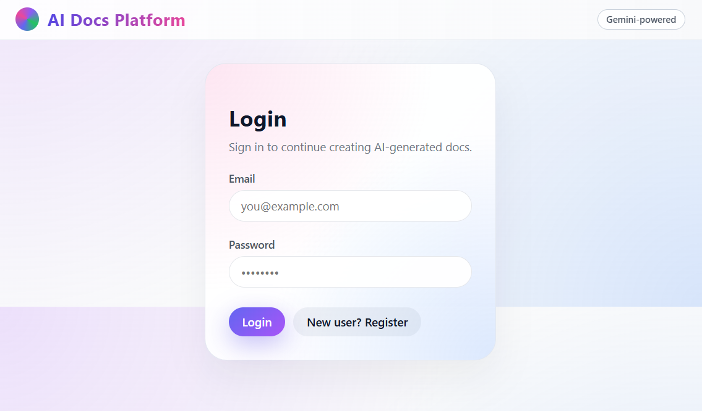
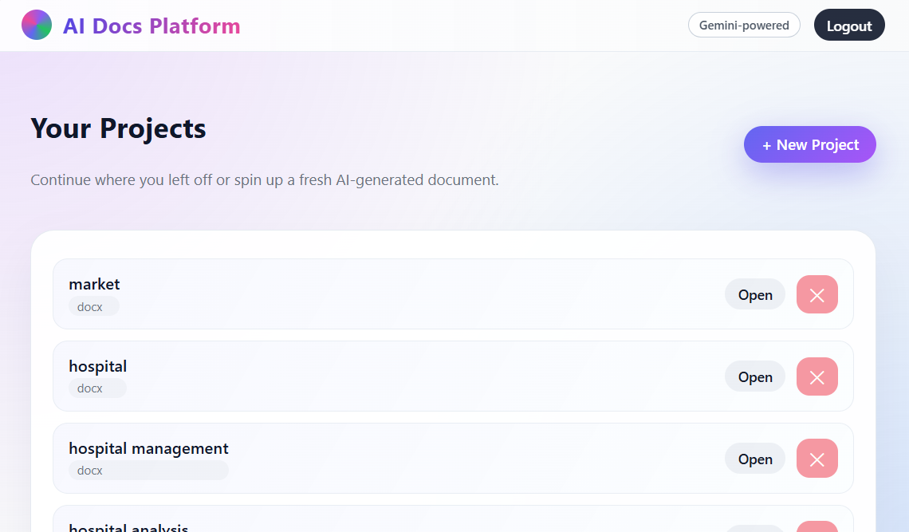
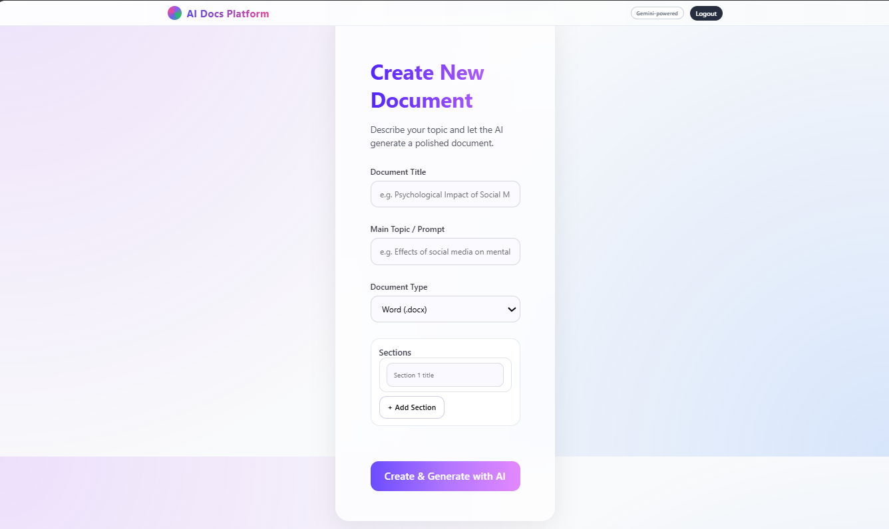
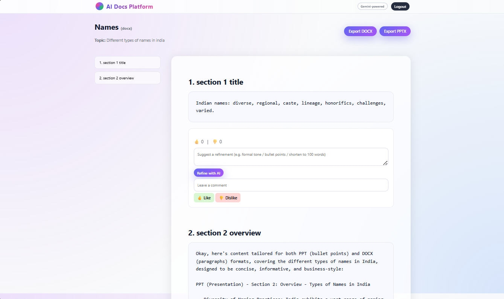
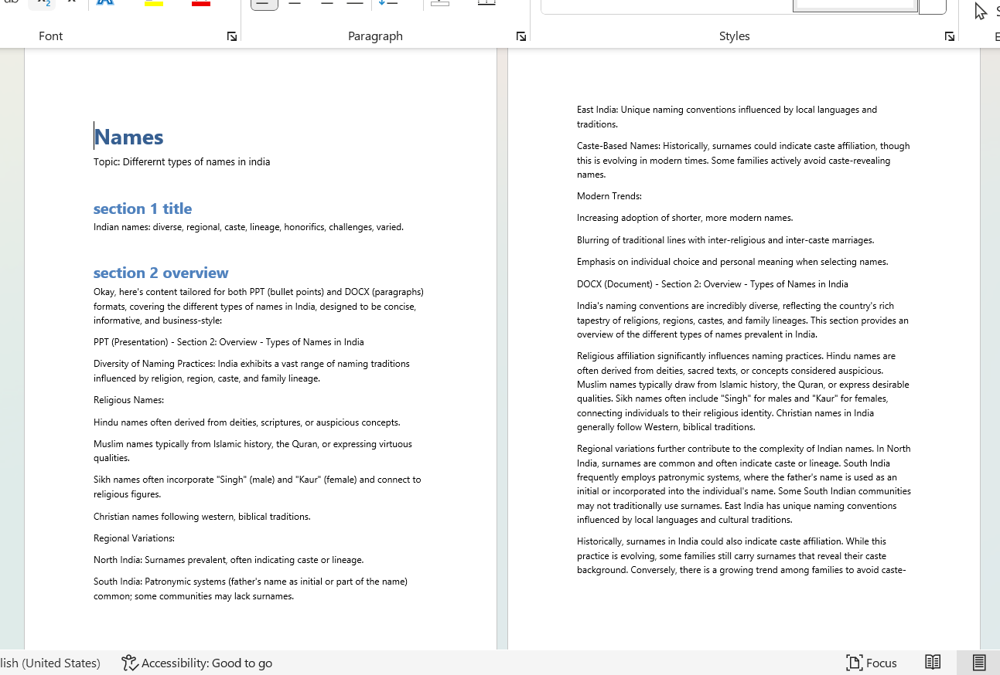

# 🚀 AI-Assisted Document Authoring & Generation Platform

A full-stack AI-powered platform to generate, refine, and export **Word (.docx)** and **PowerPoint (.pptx)** documents with ZERO manual formatting.

---

## ✨ Features

| Category             | Capability                                                 |
| -------------------- | ---------------------------------------------------------- |
| 🚪 Authentication    | Login / Register                                           |
| 📄 Document Types    | Word (.docx) / PowerPoint (.pptx)                          |
| 🧠 AI Content        | Auto-generates section/slide content using OpenAI / Gemini |
| 🔁 Feedback Loop     | Like / dislike & comments per section                      |
| 📝 Refinement        | Rewrite content using AI with custom instructions          |
| ⬇ Export             | DOCX & PPTX                                                |
| 🗂 Project Workspace | Create / edit / delete projects                            |
| 💾 Local Database    | SQLite storage                                             |

---

## 📸 Screenshots

### 🔹 Login



### 🔹 Dashboard



### 🔹 Create Project



### 🔹 Editor



### 🔹 Export



> Place all images inside: `screenshots/` in the project root.

---

## 🧠 Tech Stack

**Backend:** FastAPI, SQLAlchemy, JWT, python-docx, python-pptx
**Frontend:** React, Axios, React Router
**Database:** SQLite
**LLM Providers:** OpenAI / Gemini / Mock mode

---

## 📂 Project Folder Structure

```
ai-docs-platform/
├── backend/
│   ├── app/
│   │   ├── main.py
│   │   ├── database.py
│   │   ├── models.py
│   │   ├── schemas.py
│   │   ├── auth.py
│   │   ├── deps.py
│   │   ├── llm_client.py
│   │   ├── generator.py
│   │   └── routers/
│   │       ├── auth_router.py
│   │       ├── projects_router.py
│   │       └── export_router.py
│   ├── requirements.txt
├── frontend/
│   ├── package.json
│   ├── public/
│   └── src/
│       ├── App.js
│       ├── api.js
│       ├── components/
│       └── pages/
└── .env.example
```

---

## ⚙️ Backend Setup

```
cd backend
python -m venv venv
# Windows:
venv\Scripts\activate
# macOS/Linux:
source venv/bin/activate

pip install -r requirements.txt
```

### Create `.env` file (backend)

```
SECRET_KEY=<any-random-string>
DATABASE_URL=sqlite:///./app.db
LLM_PROVIDER=openai   # or gemini or mock
OPENAI_API_KEY=<your key if using OpenAI>
GEMINI_API_KEY=<your key if using Gemini>
```

### Run backend

```
uvicorn app.main:app --reload --port 8000
```

API docs → [http://localhost:8000/docs](http://localhost:8000/docs)

---

## 🖥 Frontend Setup

```
cd frontend
npm install
npm start
```

Runs on → [http://localhost:3000](http://localhost:3000)

---

## 🔄 Usage Flow

1️⃣ Register → login
2️⃣ Create a project (DOCX or PPTX)
3️⃣ Add sections/slides
4️⃣ Click **Generate with AI**
5️⃣ Refine using instructions per section
6️⃣ Like / dislike / comment
7️⃣ Export as **Word** or **PowerPoint**

---

## 🛠 Deployment

| Component | Recommended            |
| --------- | ---------------------- |
| Backend   | Render / Railway / EC2 |
| Frontend  | Vercel / Netlify       |
| Database  | SQLite / PostgreSQL    |

---

## 🤝 Contributing

Contributions, issues, and feature requests are welcome.

---

## 🛡 License

MIT License

---

## 👩‍💻 Author

Made with ❤️ by **Anshika Srivastava**

---

### After pasting this into README.md

Run:

```
git add README.md
git commit -m "Updated professional README"
git push
```

---
